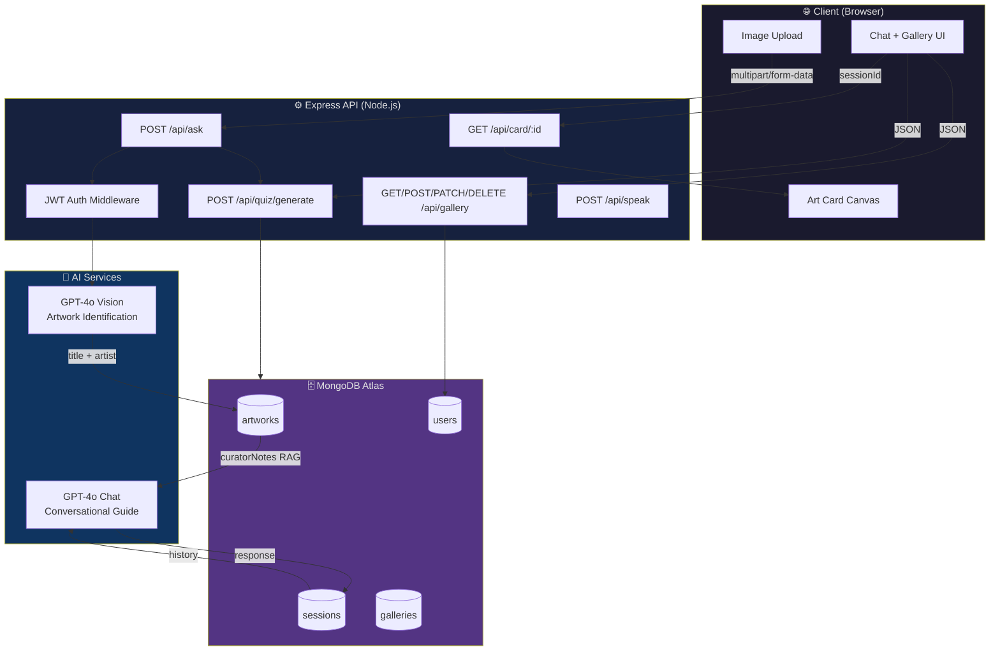
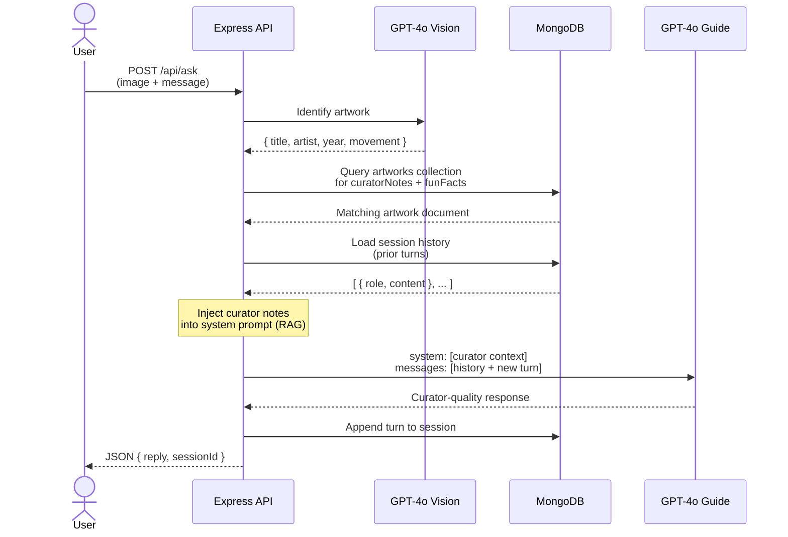
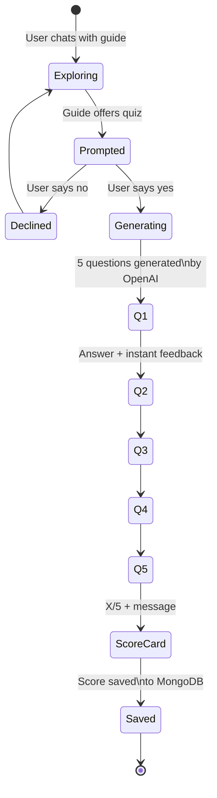
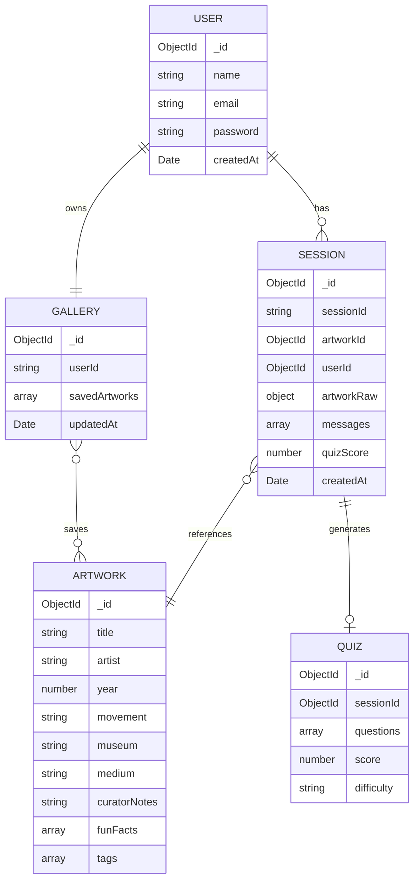
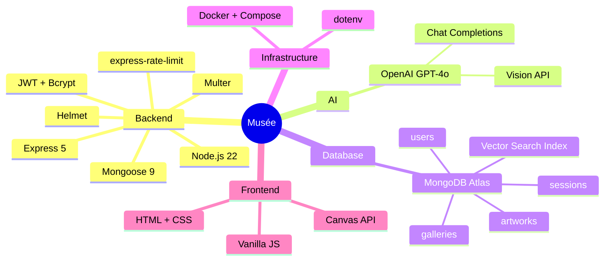

<div align="center">

# 🖼️ Musée

### *An AI-powered museum guide that speaks the language of art*

[](https://nodejs.org)
[](https://expressjs.com)
[](https://www.mongodb.com/atlas)
[](https://openai.com)
[](https://docs.docker.com/compose)
[](LICENSE)

> Upload a photo of any painting. Ask anything. Get curator-quality answers — in your language.

</div>

---

## What is Musée?

**Musée** is a full-stack AI museum companion. Point your camera at any painting, and Musée instantly identifies it and opens a live conversation — not a static info card, but a real back-and-forth with a knowledgeable guide who can answer follow-up questions, quiz you on what you've learned, recommend visually similar works, and let you save favourites to a personal gallery.

It combines **vision AI**, **RAG (Retrieval Augmented Generation)**, and **JWT auth** into one coherent product.

---

## Feature Map

```
┌───────────────────────────────────────────────────────────────────────┐
│                          MUSÉE FEATURES                               │
├─────────────────────┬─────────────────────┬───────────────────────────┤
│  🔍 Artwork Lookup   │  💬 Conversational  │  🧠 Adaptive Learning     │
│  Vision AI (GPT-4o) │  Multi-turn Chat    │  AI Quiz Generator        │
│  RAG + MongoDB      │  Session History    │  3 Difficulty Levels      │
│                     │  Multilingual       │  Score Tracking           │
├─────────────────────┼─────────────────────┼───────────────────────────┤
│  🖼️ Personal Gallery │  🔗 Sharing         │  🔒 Auth & Security       │
│  Save Artworks      │  Art Card Generator │  JWT + Bcrypt             │
│  Taste Profile      │  Canvas PNG Export  │  Rate Limiting            │
│  Movement Stats     │  Insight Captions   │  Helmet + CORS            │
└─────────────────────┴─────────────────────┴───────────────────────────┘
```

---

## System Architecture



---

## RAG Pipeline

The heart of Musée is a **Retrieval Augmented Generation** pipeline that makes every response feel grounded and expert.



---

## Quiz Flow

After exploring an artwork, users can take a dynamically generated quiz based on their actual conversation.



### Quiz Difficulty

| Level | Description | Source |
|-------|-------------|--------|
| **Novice** | Straightforward factual — all answers in the chat | Conversation only |
| **Scholar** | Requires inference, some outside knowledge | Conversation + model knowledge |
| **Expert** | Subtle symbolism, cross-work comparisons, historical nuance | Deep art history |

---

## Data Models



---

## API Reference

### Authentication

All protected routes require a `JWT Bearer token` obtained from `/api/auth/login`.

```
Authorization: Bearer <token>
```

### Endpoints

| Method | Route | Auth | Description |
|--------|-------|------|-------------|
| `POST` | `/api/auth/register` | — | Create a new user account |
| `POST` | `/api/auth/login` | — | Sign in and receive JWT |
| `POST` | `/api/ask` | ✓ | Upload image + chat with the guide |
| `POST` | `/api/quiz/generate` | ✓ | Generate a quiz from a session |
| `POST` | `/api/quiz/submit` | ✓ | Submit answers and receive score |
| `GET` | `/api/gallery` | ✓ | Fetch the user's saved gallery |
| `POST` | `/api/gallery/save` | ✓ | Save an artwork to the gallery |
| `PATCH` | `/api/gallery/:artworkId/note` | ✓ | Add or update a personal note on a saved artwork |
| `DELETE` | `/api/gallery/:artworkId` | ✓ | Remove artwork from gallery |
| `GET` | `/api/card/:sessionId` | ✓ | Generate a shareable art card (PNG) |
| `POST` | `/api/speak` | ✓ | Convert text to speech (returns MP3) |

#### `POST /api/ask` — example

```bash
curl -X POST http://localhost:3000/api/ask \
  -H "Authorization: Bearer <token>" \
  -F "image=@starry_night.jpg" \
  -F "message=What was Van Gogh feeling when he painted this?" \
  -F "sessionId=abc-123" \
  -F "language=en"
```

```json
{
  "reply": "Van Gogh painted The Starry Night in June 1889 while voluntarily confined at the Saint-Paul-de-Mausole asylum...",
  "sessionId": "abc-123",
  "artwork": {
    "title": "The Starry Night",
    "artist": "Vincent van Gogh",
    "year": 1889,
    "movement": "Post-Impressionism"
  }
}
```

---

## Tech Stack



---

## Getting Started

### Prerequisites

- Node.js 22+
- Docker + Docker Compose (recommended)
- MongoDB Atlas account or local MongoDB
- OpenAI API key

### 1. Clone & install

```bash
git clone <repo-url>
cd museum-guide-chatbot
npm install
```

### 2. Configure environment

Create a `.env` file in the project root:

```env
PORT=3000
MONGODB_URI=mongodb+srv://<user>:<pass>@cluster.mongodb.net/musee
JWT_SECRET=your_super_secret_jwt_key_here
OPENAI_API_KEY=sk-...
CORS_ORIGIN=http://localhost:3000
```

### 3. Run with Docker

```bash
docker compose up --build -d
```

Or run locally:

```bash
npm start
```

### 4. Seed the database

```bash
npm run seed
```

### 5. Open the UI

Navigate to [http://localhost:3000](http://localhost:3000) and start exploring.

---

## Security

| Concern | Implementation |
|---------|---------------|
| Password storage | `bcryptjs` — salted hash, never plaintext |
| Auth tokens | JWT with configurable expiry, `Authorization: Bearer` header |
| Input validation | `express-validator` on all auth routes |
| HTTP security headers | `helmet` — XSS, clickjacking, MIME sniffing protection |
| Rate limiting | Auth: 20 req/15 min · AI routes (`/api/ask`, `/api/quiz/generate`, `/api/card`, `/api/speak`): 10 req/60 s |
| CORS | Restricted to `CORS_ORIGIN` env var |
| File uploads | `multer` with type/size validation |

---

## Roadmap

- ✅ Artwork identification via Vision AI
- ✅ RAG pipeline with MongoDB curator notes
- ✅ Multi-turn conversation sessions
- ✅ User authentication (JWT + bcrypt)
- ✅ Personal gallery with taste profile
- ✅ AI quiz generator (3 difficulty levels)
- ✅ Shareable art card (Canvas PNG export)
- ✅ Multilingual support (auto-detect language)
- ✅ Personal notes on saved gallery artworks
- ✅ Export gallery as PDF


---

<div align="center">

Built with curiosity and a deep appreciation for art.

*"Every artist dips his brush in his own soul, and paints his own nature into his pictures." — Henry Ward Beecher*

</div>
